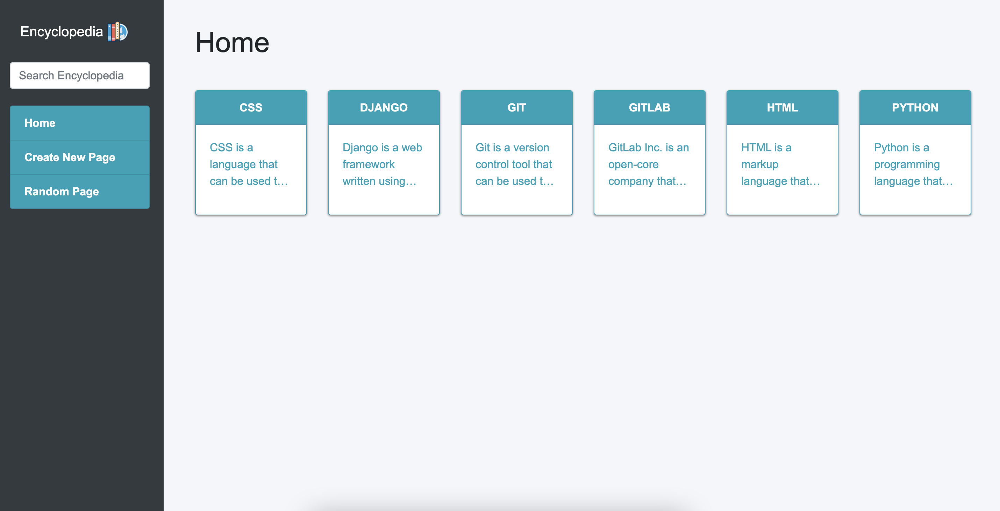

<div align="center" id="top"> 
  

&#xa0;

  <!-- <a href="https://wiki.netlify.app">Demo</a> -->
</div>

<h1 align="center">Encyclopedia</h1>

<p align="center">
  
  
  
</p>

<!-- Status -->

<!-- <h4 align="center">
	🚧  Wiki 🚀 Under construction...  🚧
</h4>

<hr> -->

<p align="center">
  <a href="#dart-about">About</a> &#xa0; | &#xa0; 
  <a href="#sparkles-features">Features</a> &#xa0; | &#xa0;
  <a href="#rocket-technologies">Technologies</a> &#xa0; | &#xa0;
  <a href="#white_check_mark-requirements">Requirements</a> &#xa0; | &#xa0;
  <a href="#checkered_flag-starting">Starting</a> &#xa0; | &#xa0;
  <a href="https://github.com/NDRBAX" target="_blank">Author</a>
</p>

<br>

## :dart: About

A Wikipedia-like online encyclopedia.

## :sparkles: Features

:heavy_check_mark: Create new article\
:heavy_check_mark: Edit articles\
:heavy_check_mark: Show random articles

## :rocket: Technologies

The following tools were used in this project:

- [Python](https://www.python.org/)
- [Django](https://www.djangoproject.com/)
- [Bootstrap 4.4](https://getbootstrap.com/docs/4.4/getting-started/introduction/)

## :white_check_mark: Requirements

Before starting :checkered_flag:, you need to have [Python](https://www.python.org/) and [pip](https://pypi.org/project/pip/) installed.

## :checkered_flag: Starting

```bash
# Clone this project
$ git clone https://github.com/NDRBAX/Encyclopedia

# Access
$ cd Encyclopedia

# Install dependencies
$ pip install -r requirements.txt

# Run 
$ python manage.py runserver

```

Made with :heart: by <a href="https://github.com/NDRBAX" target="_blank">NDRBAX</a>

&#xa0;

<a href="#top">Back to top</a>
